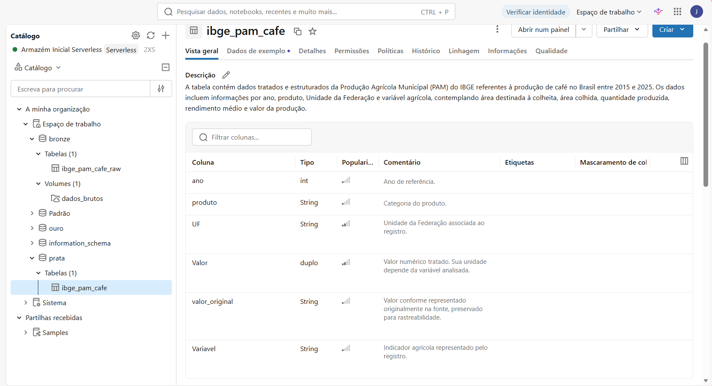
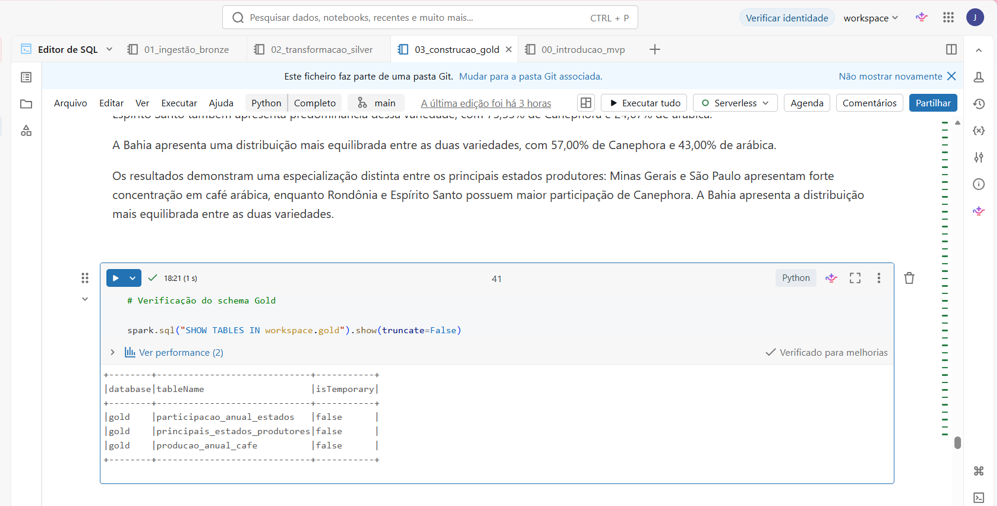
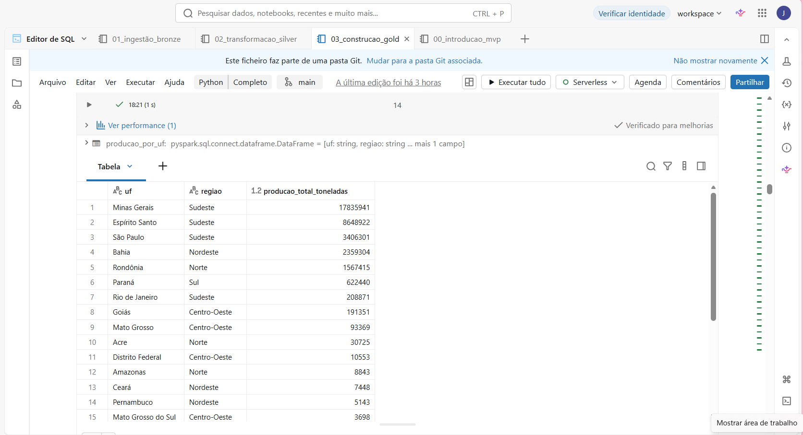
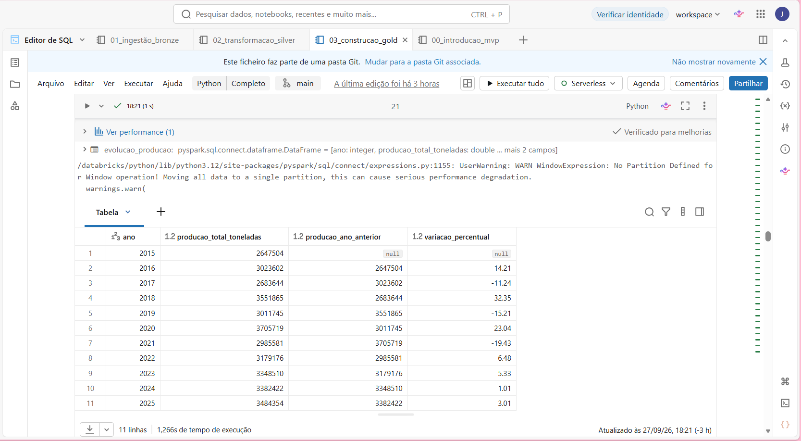
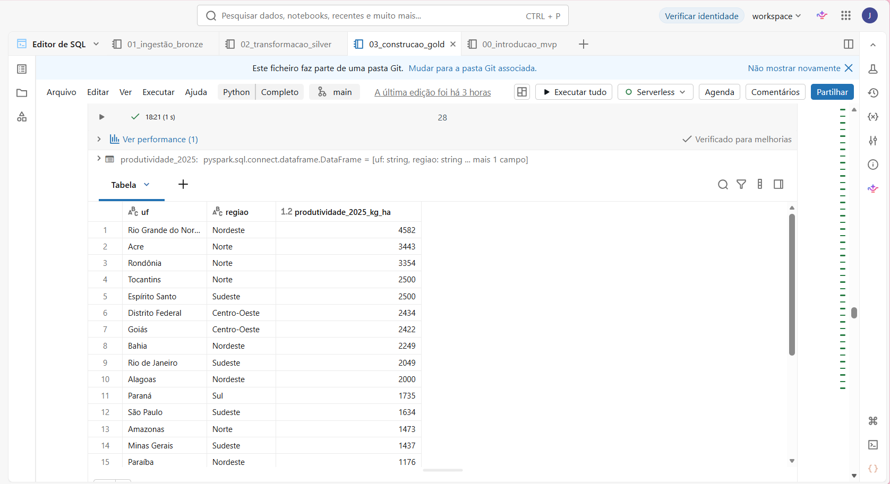
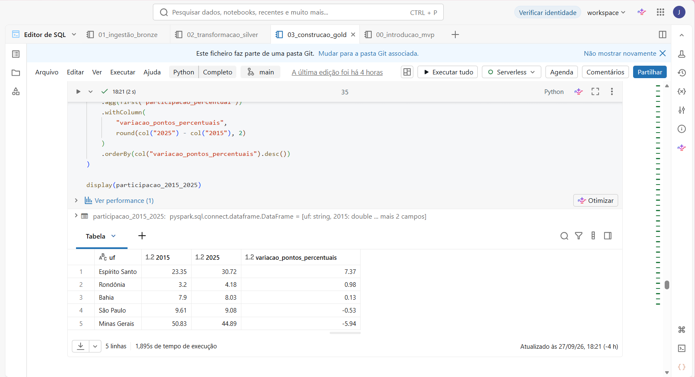
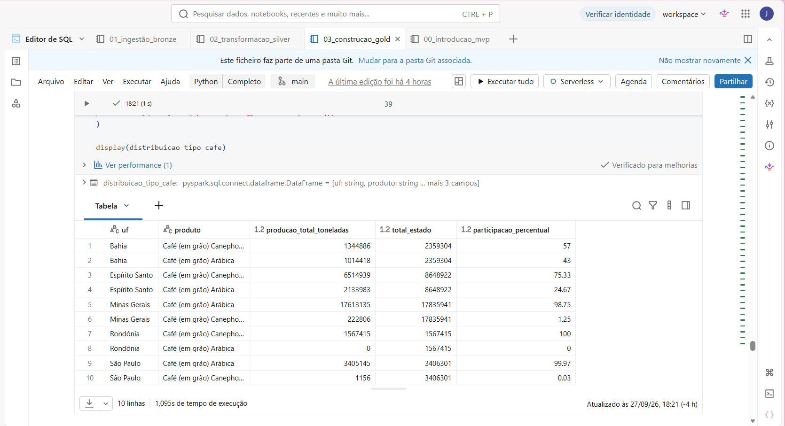

# MVP de Engenharia de Dados

## Análise da Produção de Café no Brasil — 2015 a 2025

**Aluno(a):** Jéssica Alves de Melo Caetano  
**Matrícula:** 4052025002261  
**Disciplina:** Engenharia de Dados  
**Curso:** Ciência de Dados e Analytics  

---

## Sobre o Projeto

Este repositório apresenta o MVP desenvolvido para a disciplina de **Engenharia de Dados**, utilizando o **Databricks** como plataforma em nuvem para construção e execução do pipeline de dados.

O projeto utiliza dados públicos da **Produção Agrícola Municipal (PAM)**, disponibilizados pelo Instituto Brasileiro de Geografia e Estatística (IBGE), com foco na produção de café no Brasil entre os anos de **2015 e 2025**.

O pipeline foi estruturado segundo a arquitetura em camadas **Bronze, Silver e Gold**, permitindo separar a ingestão dos dados brutos, o processo de tratamento e estruturação e, por fim, a disponibilização de dados preparados para consumo analítico.

### Organização do Projeto

O desenvolvimento foi dividido em quatro notebooks:

| Notebook | Finalidade |
|---|---|
| `00_introducao_mvp.ipynb` | Apresentação do contexto, objetivos, fonte dos dados, modelagem, catálogo e linhagem do projeto. |
| `01_ingestão_bronze.ipynb` | Ingestão do arquivo CSV e armazenamento dos dados brutos na camada Bronze. |
| `02_transformacao_silver.ipynb` | Tratamento, interpretação e estruturação dos dados na camada Silver. |
| `03_construcao_gold.ipynb` | Construção das estruturas analíticas da camada Gold e realização das análises do MVP. |

### Arquitetura do Pipeline

`IBGE/PAM → CSV → Volume do Unity Catalog → Bronze → Silver → Gold → Análise`

---
## 1. Contexto de Negócio e Perguntas (Etapa 2 e 4.1)

A produção de café possui relevância econômica e agrícola no Brasil e apresenta diferenças entre estados, regiões, períodos e tipos de café produzidos. Para que essas informações possam ser utilizadas de forma analítica, é necessário organizar e estruturar os dados provenientes de fontes públicas, permitindo acompanhar a evolução da produção e identificar diferenças entre os principais estados produtores.

O objetivo deste MVP é construir um pipeline de Engenharia de Dados no Databricks utilizando dados da **Produção Agrícola Municipal (PAM)** do IBGE referentes à produção de café no Brasil entre **2015 e 2025**.

A construção do pipeline foi orientada pelas seguintes perguntas de negócio:

1. Quais estados e regiões concentram a maior produção de café?
2. Como a produção de café evoluiu ao longo do período analisado?
3. Quais estados apresentam maior produtividade?
4. Como a participação dos principais estados produtores mudou ao longo dos anos?
5. Como a produção de café arábica e conilon se distribui entre os principais estados produtores?

### Dados Brutos

A base utilizada foi obtida a partir da **Produção Agrícola Municipal (PAM)**, disponibilizada pelo Instituto Brasileiro de Geografia e Estatística (IBGE) por meio do **Sistema IBGE de Recuperação Automática (SIDRA)**.

Foi utilizado um recorte referente ao período de **2015 a 2025**, contendo informações relacionadas às Unidades da Federação e aos seguintes indicadores:

- Área destinada à colheita;
- Área colhida;
- Quantidade produzida;
- Rendimento médio da produção;
- Valor da produção.

Os dados também apresentam diferentes categorias para o produto café, incluindo **Café (em grão) Total, Café (em grão) Arábica e Café (em grão) Canephora**, além da categoria Total existente na estrutura da fonte.

O arquivo utilizado no pipeline possui formato **CSV** e foi preservado inicialmente em sua estrutura bruta antes das etapas de tratamento.

### Fonte e Condições de Utilização

Os dados são provenientes de uma fonte pública oficial do **Instituto Brasileiro de Geografia e Estatística (IBGE)**. O IBGE mantém um Plano de Dados Abertos no contexto da Política de Dados Abertos do Poder Executivo Federal.

Na documentação oficial consultada para este projeto, não foi identificada uma licença Creative Commons específica associada à tabela da PAM utilizada. Por esse motivo, não é atribuída ao conjunto uma licença específica não declarada pela fonte, mantendo-se a identificação e atribuição ao **IBGE/PAM/SIDRA**.

**Fonte:** IBGE — Produção Agrícola Municipal (PAM) / SIDRA.

---

## 2. Carga dos Dados (Etapa 4.2)

Após a obtenção dos dados da Produção Agrícola Municipal (PAM), o arquivo utilizado no projeto foi disponibilizado em formato **CSV** no ambiente Databricks.

O arquivo foi armazenado em um **Volume do Unity Catalog**, no seguinte caminho:

`/Volumes/workspace/bronze/dados_brutos/ibge_pam_cafe_2015_2025.csv`

A utilização do Volume permite manter o arquivo de origem disponível dentro da plataforma em nuvem e separado das tabelas criadas posteriormente durante o processamento.

A ingestão dos dados foi realizada no notebook [`01_ingestão_bronze.ipynb`](01_ingestão_bronze.ipynb).

Durante essa etapa, o arquivo foi lido e persistido na tabela:

`workspace.bronze.ibge_pam_cafe_raw`

A tabela Bronze possui **204 registros** e preserva cada linha do arquivo de origem por meio do campo `linha_original`. Também foi incluído o campo `data_ingestao`, permitindo registrar o momento em que os dados foram incorporados ao pipeline.

O fluxo de carga inicial pode ser resumido da seguinte forma:

**IBGE/PAM → Arquivo CSV → Volume do Unity Catalog → `workspace.bronze.ibge_pam_cafe_raw`**

A preservação dos dados na camada Bronze permite manter a rastreabilidade da fonte original antes das etapas de interpretação, tratamento e estruturação realizadas na camada Silver.

**Notebook responsável:** [`01_ingestão_bronze.ipynb`](01_ingestão_bronze.ipynb)

---

## 3. Modelagem e Catálogo de Dados (Etapa 4.3)

A modelagem do projeto foi organizada segundo a arquitetura **Medallion**, utilizando as camadas **Bronze, Silver e Gold** dentro do ambiente Lakehouse do Databricks.

A separação em camadas permite manter diferentes níveis de tratamento dos dados e preservar sua rastreabilidade desde a fonte original até as estruturas utilizadas nas análises.

### Arquitetura dos Dados

**Bronze — Dados Brutos**

A camada Bronze preserva os dados ingeridos em estrutura próxima à fonte original.

Tabela:

`workspace.bronze.ibge_pam_cafe_raw`

**Silver — Dados Tratados e Estruturados**

A camada Silver recebe os dados da Bronze e realiza sua interpretação, tratamento e reorganização em uma estrutura tabular adequada para análise.

Tabela:

`workspace.silver.ibge_pam_cafe`

**Gold — Dados para Consumo Analítico**

A camada Gold utiliza os dados tratados da Silver para gerar estruturas agregadas orientadas às perguntas de negócio.

Tabelas:

- `workspace.gold.producao_anual_cafe`
- `workspace.gold.principais_estados_produtores`
- `workspace.gold.participacao_anual_estados`

O fluxo de dados implementado pode ser representado como:

**Arquivo CSV → Bronze → Silver → Gold → Consumo Analítico**

### Linhagem Geral

`IBGE/PAM → CSV → Volume do Unity Catalog → workspace.bronze.ibge_pam_cafe_raw → workspace.silver.ibge_pam_cafe → tabelas analíticas da camada Gold`

A implementação da transformação e estruturação dos dados pode ser consultada no notebook [`02_transformacao_silver.ipynb`](02_transformacao_silver.ipynb), enquanto a construção das estruturas analíticas está disponível no notebook [`03_construcao_gold.ipynb`](03_construcao_gold.ipynb).

### Catálogo de Dados

O catálogo abaixo descreve as tabelas persistidas nas camadas Bronze, Silver e Gold, apresentando seus campos, tipos, significado e domínio dos valores.

#### Bronze — `workspace.bronze.ibge_pam_cafe_raw`

Tabela com **204 registros**, responsável pela preservação dos dados ingeridos a partir do arquivo de origem.

| Campo | Tipo | Descrição | Domínio |
|---|---|---|---|
| `linha_original` | string | Conteúdo textual original de cada linha do arquivo CSV. | Texto proveniente do arquivo de origem. |
| `data_ingestao` | timestamp | Data e horário da ingestão do registro. | Data e hora da execução da ingestão. |

#### Silver — `workspace.silver.ibge_pam_cafe`

Tabela com **6.160 registros**, contendo os dados interpretados, tratados e estruturados para utilização nas análises.

| Campo | Tipo | Descrição | Domínio |
|---|---|---|---|
| `ano` | integer | Ano de referência. | 2015 a 2025. |
| `produto` | string | Categoria do produto. | Total; Café (em grão) Total; Arábica; Canephora. |
| `uf` | string | Unidade da Federação associada ao registro. | 28 valores presentes na fonte, incluindo `Guanabara`. |
| `valor` | double | Valor numérico tratado. Sua unidade depende da variável analisada. | 0,0 a 56.643.071,0. |
| `valor_original` | string | Valor conforme representado originalmente na fonte, preservado para rastreabilidade. | Valores numéricos e convenções existentes no arquivo do IBGE. |
| `variavel` | string | Indicador agrícola representado pelo registro. | Área destinada à colheita; Área colhida; Quantidade produzida; Rendimento médio da produção; Valor da produção. |

As unidades associadas às variáveis são hectares para áreas, toneladas para quantidade produzida, quilogramas por hectare para rendimento médio e mil reais para valor da produção.

#### Gold — `workspace.gold.producao_anual_cafe`

Tabela com **11 registros**, contendo a produção nacional anual de café.

| Campo | Tipo | Descrição | Domínio |
|---|---|---|---|
| `ano` | integer | Ano de referência. | 2015 a 2025. |
| `producao_total_toneladas` | double | Produção total nacional de café no ano. | 2.647.504,0 a 3.705.719,0 toneladas. |

#### Gold — `workspace.gold.principais_estados_produtores`

Tabela com **5 registros**, contendo os cinco estados com maior produção acumulada no período analisado.

| Campo | Tipo | Descrição | Domínio |
|---|---|---|---|
| `uf` | string | Unidade da Federação. | Bahia; Espírito Santo; Minas Gerais; Rondônia; São Paulo. |
| `regiao` | string | Região geográfica correspondente à UF. | Nordeste; Norte; Sudeste. |
| `producao_total_toneladas` | double | Produção acumulada do estado entre 2015 e 2025. | 1.567.415,0 a 17.835.941,0 toneladas. |

#### Gold — `workspace.gold.participacao_anual_estados`

Tabela com **55 registros**, correspondentes aos 5 principais estados ao longo dos 11 anos analisados.

| Campo | Tipo | Descrição | Domínio |
|---|---|---|---|
| `ano` | integer | Ano de referência. | 2015 a 2025. |
| `uf` | string | Unidade da Federação. | Bahia; Espírito Santo; Minas Gerais; Rondônia; São Paulo. |
| `producao_estado_toneladas` | double | Produção anual do estado. | 84.734,0 a 2.064.689,0 toneladas. |
| `producao_total_toneladas` | double | Produção nacional no respectivo ano. | 2.647.504,0 a 3.705.719,0 toneladas. |
| `participacao_percentual` | double | Participação do estado na produção nacional. | 2,99% a 60,66%. |

### Evidência do Catálogo de Dados

A estrutura das tabelas foi registrada no **Unity Catalog do Databricks**, permitindo visualizar os campos, tipos de dados e suas respectivas descrições. A imagem abaixo apresenta como evidência a tabela Silver `ibge_pam_cafe`.

*Figura 1 — Estrutura da tabela `ibge_pam_cafe` no Unity Catalog do Databricks.*

---

## 4. Pipeline de Dados (Etapa 4.4)

O pipeline de dados foi desenvolvido no **Databricks utilizando PySpark** e organizado em notebooks separados de acordo com as etapas de processamento. Essa divisão foi adotada para facilitar a organização, execução, manutenção e rastreabilidade das transformações realizadas entre as camadas.

O processo segue o conceito de **ETL (Extract, Transform, Load)** e a arquitetura em camadas Bronze, Silver e Gold.

### Extração e Ingestão — Bronze

**Notebook:** [`01_ingestão_bronze.ipynb`](01_ingestão_bronze.ipynb)

O arquivo CSV proveniente dos dados da PAM/IBGE foi lido a partir de um Volume do Unity Catalog e ingerido no Databricks.

Nesta etapa, buscou-se preservar o conteúdo em estrutura próxima à fonte original, resultando na tabela:

`workspace.bronze.ibge_pam_cafe_raw`

**Impacto:** os dados de origem permanecem disponíveis antes das transformações, permitindo rastreabilidade e reprocessamento do pipeline.

### Transformação — Silver

**Notebook:** [`02_transformacao_silver.ipynb`](02_transformacao_silver.ipynb)

A estrutura original do arquivo continha diferentes blocos de indicadores agrícolas e informações auxiliares. Durante a transformação, as linhas relevantes foram interpretadas e reorganizadas em uma estrutura tabular.

Entre as principais transformações realizadas estão:

- identificação e interpretação dos diferentes blocos de variáveis;
- reorganização dos dados por ano, produto, Unidade da Federação e variável;
- conversão dos valores utilizados nas análises para representação numérica;
- preservação do valor original no campo `valor_original`, mantendo a rastreabilidade;
- consideração das convenções e símbolos existentes na fonte do IBGE;
- estruturação das cinco variáveis agrícolas presentes no conjunto de dados.

O resultado foi persistido na tabela:

`workspace.silver.ibge_pam_cafe`

**Impacto:** os dados brutos passaram a possuir uma estrutura padronizada e adequada para consultas, agregações e análises.

### Transformação e Carga Analítica — Gold

**Notebook:** [`03_construcao_gold.ipynb`](03_construcao_gold.ipynb)

A camada Gold foi construída a partir dos dados tratados da Silver. Nesta etapa foram realizadas filtragens, agregações e cálculos orientados às perguntas de negócio.

Entre as principais transformações estão:

- seleção dos registros relacionados à produção de café;
- exclusão do registro histórico `Guanabara` da base utilizada nas análises;
- associação das Unidades da Federação às respectivas regiões;
- agregação da produção por ano;
- agregação da produção por estado;
- identificação dos cinco principais estados produtores;
- cálculo da participação percentual anual dos principais estados em relação à produção nacional.

Como resultado, foram persistidas as tabelas:

- `workspace.gold.producao_anual_cafe`
- `workspace.gold.principais_estados_produtores`
- `workspace.gold.participacao_anual_estados`

As cargas das tabelas Gold foram realizadas em formato **Delta**, utilizando sobrescrita controlada (`overwrite`), permitindo a reexecução do processo sem acumular registros duplicados.

### Fluxo do Pipeline

**Extract:** IBGE/PAM → arquivo CSV → Volume do Unity Catalog  
**Transform:** Bronze → interpretação e tratamento → Silver → agregações e cálculos analíticos  
**Load:** persistência das tabelas Bronze, Silver e Gold no Databricks

Dessa forma, o pipeline completo pode ser representado como:

**Fonte IBGE/PAM → CSV → Bronze → Silver → Gold → Análise**

### Evidência da Persistência das Tabelas

As estruturas analíticas resultantes do pipeline foram persistidas no ambiente Databricks. A consulta ao schema Gold evidencia a existência das três tabelas utilizadas para disponibilização dos dados analíticos.

*Figura 2 — Tabelas da camada Gold persistidas no Databricks. O campo `isTemporary = false` evidencia que as estruturas foram salvas como tabelas não temporárias.*

---

## 5. Qualidade de Dados (Etapa 4.5)

A qualidade dos dados foi considerada durante as etapas de ingestão, transformação e preparação das estruturas analíticas. Como a fonte utilizada possui características próprias de apresentação, foram necessários tratamentos para transformar o arquivo original em uma estrutura adequada para análise sem perder a rastreabilidade dos dados.

### Estrutura do Arquivo de Origem

O arquivo CSV obtido a partir da PAM/IBGE não apresentava os dados em uma única estrutura tabular pronta para análise. O conteúdo estava organizado em blocos correspondentes a cinco variáveis:

- Área destinada à colheita;
- Área colhida;
- Quantidade produzida;
- Rendimento médio da produção;
- Valor da produção.

Além dos registros de dados, o arquivo também continha cabeçalhos, notas e legendas. Na transformação para a camada Silver, foram selecionadas e interpretadas apenas as linhas correspondentes aos registros analíticos, enquanto a estrutura original permaneceu preservada na camada Bronze.

### Convenções e Valores Especiais da Fonte

A fonte utiliza convenções próprias para representar determinadas situações nos dados, incluindo símbolos como `-`, `0`, `X`, `...` e `..`.

Essas ocorrências foram consideradas durante o tratamento para evitar que símbolos textuais fossem interpretados incorretamente como valores numéricos. Além disso, o campo `valor_original` foi mantido na camada Silver para preservar a representação proveniente da fonte e facilitar a rastreabilidade das transformações.

### Padronização e Tipagem

Durante a transformação Bronze → Silver, os registros foram reorganizados em uma estrutura padronizada composta por:

`ano`, `produto`, `uf`, `valor`, `valor_original` e `variavel`.

O ano foi convertido para tipo inteiro e os valores utilizados nas análises foram convertidos para tipo numérico (`double`). Essa estrutura permitiu realizar filtros, agregações e cálculos de forma consistente nas etapas posteriores.

### Tratamento do Registro Histórico de Guanabara

A fonte apresenta `Guanabara` entre os valores do campo de Unidade da Federação. O registro foi mantido na camada Silver para preservar fidelidade e rastreabilidade em relação à fonte original.

Entretanto, como as análises do MVP consideram a estrutura atual das **27 Unidades da Federação brasileiras**, `Guanabara` foi excluída da base utilizada na construção das análises da camada Gold.

Dessa forma, a camada Silver preserva os dados provenientes da fonte, enquanto a Gold aplica as regras necessárias ao contexto analítico do projeto.

### Resultado do Tratamento

Após as transformações, a tabela Silver passou a possuir **6.160 registros estruturados**, abrangendo os anos de **2015 a 2025**, os diferentes produtos relacionados ao café, as variáveis agrícolas e as Unidades da Federação presentes na fonte.

A separação entre `valor` e `valor_original`, juntamente com a manutenção da camada Bronze, permite rastrear os dados desde sua representação original até as estruturas utilizadas nas análises.

Os tratamentos implementados possibilitaram construir a camada Gold a partir de dados padronizados e adequados às perguntas de negócio, sem alterar a informação original armazenada na camada Bronze.

---

## 6. Análise de Dados (Etapa 4.5)

A análise final foi realizada no notebook [`03_construcao_gold.ipynb`](03_construcao_gold.ipynb), utilizando os dados tratados da camada Silver e as estruturas analíticas construídas durante o desenvolvimento da camada Gold.

As análises foram orientadas pelas cinco perguntas de negócio definidas no início do projeto.

### 6.1 Quais estados e regiões concentram a maior produção de café?

Considerando a produção acumulada entre **2015 e 2025**, os cinco principais estados produtores identificados foram:

| Posição | Estado | Região | Produção acumulada (toneladas) |
|---|---|---|---:|
| 1 | Minas Gerais | Sudeste | 17.835.941 |
| 2 | Espírito Santo | Sudeste | 8.648.922 |
| 3 | São Paulo | Sudeste | 3.406.301 |
| 4 | Bahia | Nordeste | 2.359.304 |
| 5 | Rondônia | Norte | 1.567.415 |

Os resultados mostram uma forte concentração da produção entre estados da **Região Sudeste**. Minas Gerais apresenta a maior produção acumulada do período, seguido pelo Espírito Santo. São Paulo também integra os cinco maiores produtores, fazendo com que três dos cinco principais estados estejam localizados no Sudeste.

Bahia e Rondônia representam, respectivamente, as regiões Nordeste e Norte entre os cinco principais produtores.

Assim, para o período analisado, a produção de café apresenta concentração especialmente relevante no **Sudeste**, com destaque para **Minas Gerais e Espírito Santo**.

#### Evidência da análise

A tabela abaixo apresenta a produção acumulada de café por Unidade da Federação no período analisado, ordenada de forma decrescente, permitindo identificar os estados com maior concentração da produção.

*Figura 3 — Produção acumulada de café por estado e região entre 2015 e 2025.*

### 6.2 Como a produção de café evoluiu ao longo do período analisado?

A análise da produção nacional de café entre **2015 e 2025** mostra oscilações ao longo do período, sem um crescimento contínuo ano após ano.

| Ano | Produção total (toneladas) |
|---:|---:|
| 2015 | 2.647.504 |
| 2016 | 3.023.602 |
| 2017 | 2.683.644 |
| 2018 | 3.551.865 |
| 2019 | 3.011.745 |
| 2020 | 3.705.719 |
| 2021 | 2.985.581 |
| 2022 | 3.179.176 |
| 2023 | 3.348.510 |
| 2024 | 3.382.422 |
| 2025 | 3.484.354 |

O menor volume do período analisado ocorreu em **2015**, com aproximadamente **2,65 milhões de toneladas**, enquanto o maior foi registrado em **2020**, com aproximadamente **3,71 milhões de toneladas**.

Após o pico de 2020, houve redução da produção em 2021, seguida por uma recuperação gradual entre **2022 e 2025**. Em 2025, a produção alcançou aproximadamente **3,48 milhões de toneladas**, permanecendo abaixo do máximo observado em 2020.

Comparando o início e o final do período, a produção passou de **2.647.504 toneladas em 2015 para 3.484.354 toneladas em 2025**, indicando que, apesar das oscilações anuais, o volume produzido ao final do período foi superior ao observado no início.

#### Evidência da análise

A tabela abaixo apresenta a evolução anual da produção nacional de café e a variação percentual em relação ao ano anterior, evidenciando as oscilações observadas durante o período analisado.

*Figura 4 — Evolução da produção nacional de café e variação percentual anual entre 2015 e 2025.*

### 6.3 Quais estados apresentam maior produtividade?

Para comparar a produtividade entre os estados, foi utilizado o indicador **Rendimento médio da produção**, expresso em **quilogramas por hectare (kg/ha)**. A análise considera o ano de **2025**, último ano disponível no conjunto de dados.

Os cinco estados com maior produtividade em 2025 foram:

| Posição | Estado | Região | Produtividade (kg/ha) |
|---|---|---|---:|
| 1 | Rio Grande do Norte | Nordeste | 4.582 |
| 2 | Acre | Norte | 3.443 |
| 3 | Rondônia | Norte | 3.354 |
| 4 | Tocantins | Norte | 2.500 |
| 5 | Espírito Santo | Sudeste | 2.500 |

O **Rio Grande do Norte** apresentou o maior rendimento médio em 2025, com **4.582 kg/ha**, seguido por Acre e Rondônia, com **3.443 kg/ha** e **3.354 kg/ha**, respectivamente.

Os resultados também mostram que produtividade e volume total produzido representam medidas distintas. Um estado pode apresentar elevada produtividade por hectare sem necessariamente estar entre os maiores produtores em volume total.

Essa diferença pode ser observada ao comparar os resultados desta análise com os da Pergunta 1. **Minas Gerais**, líder em produção acumulada no período analisado, apresentou rendimento médio de **1.437 kg/ha em 2025**, enquanto estados com menor participação no volume nacional aparecem entre os primeiros colocados em produtividade.

#### Evidência da análise

A tabela abaixo apresenta o ranking de produtividade dos estados em 2025, calculado a partir do indicador de rendimento médio da produção, expresso em quilogramas por hectare.

*Figura 5 — Produtividade dos estados brasileiros em 2025, expressa em kg/ha.*

### 6.4 Como a participação dos principais estados produtores mudou ao longo dos anos?

Para avaliar as mudanças na participação dos principais estados produtores, foi calculada a proporção da produção de cada um dos cinco maiores produtores em relação à produção nacional de café. A comparação entre **2015 e 2025** permite observar como essa participação se modificou entre o início e o final do período analisado.

| Estado | Participação em 2015 | Participação em 2025 | Variação (p.p.) |
|---|---:|---:|---:|
| Espírito Santo | 23,35% | 30,72% | +7,37 |
| Rondônia | 3,20% | 4,18% | +0,98 |
| Bahia | 7,90% | 8,03% | +0,13 |
| São Paulo | 9,61% | 9,08% | -0,53 |
| Minas Gerais | 50,83% | 44,89% | -5,94 |

Entre os estados analisados, o **Espírito Santo** apresentou o maior aumento de participação, passando de **23,35% em 2015 para 30,72% em 2025**, crescimento de **7,37 pontos percentuais**.

**Rondônia** também ampliou sua participação, de 3,20% para 4,18%, enquanto a **Bahia** permaneceu relativamente estável, passando de 7,90% para 8,03%.

Em sentido contrário, **São Paulo** apresentou pequena redução, de 9,61% para 9,08%. **Minas Gerais**, embora tenha permanecido como o principal estado produtor, teve sua participação reduzida de **50,83% para 44,89%**, uma diferença de **5,94 pontos percentuais**.

Os resultados mostram que a distribuição da produção entre os principais estados sofreu alterações ao longo do período, com destaque para o aumento da participação do Espírito Santo e a redução da participação relativa de Minas Gerais.

#### Evidência da análise

A tabela abaixo apresenta a comparação da participação dos cinco principais estados produtores entre 2015 e 2025, incluindo a variação em pontos percentuais no período.

*Figura 6 — Comparação da participação dos principais estados produtores de café em 2015 e 2025 e respectiva variação em pontos percentuais.*

### 6.5 Como a produção de café arábica e Canephora se distribui entre os principais estados produtores?

A análise da distribuição entre **café Arábica e Canephora** foi realizada considerando a produção acumulada entre **2015 e 2025** nos cinco principais estados produtores identificados no projeto.

| Estado | Arábica | Canephora |
|---|---:|---:|
| Minas Gerais | 98,75% | 1,25% |
| Espírito Santo | 24,67% | 75,33% |
| São Paulo | 99,97% | 0,03% |
| Bahia | 43,00% | 57,00% |
| Rondônia | 0,00% | 100,00% |

Os resultados mostram diferenças marcantes no perfil da produção entre os estados.

**Minas Gerais** apresenta forte concentração em café Arábica, que corresponde a **98,75%** de sua produção no período. Comportamento semelhante ocorre em **São Paulo**, onde o Arábica representa **99,97%** da produção.

Em sentido contrário, **Rondônia** apresenta produção totalmente concentrada em Canephora nos dados analisados, com **100%** de participação dessa variedade. O **Espírito Santo** também apresenta predominância de Canephora, com **75,33%**, enquanto o Arábica representa 24,67%.

A **Bahia** apresenta a distribuição mais equilibrada entre as duas variedades dentre os cinco estados analisados, com **57,00% de Canephora e 43,00% de Arábica**.

Assim, a análise evidencia perfis distintos de produção: Minas Gerais e São Paulo apresentam forte concentração em Arábica; Rondônia e Espírito Santo possuem predominância de Canephora; e a Bahia apresenta uma distribuição mais equilibrada entre as duas variedades.

#### Evidência da análise

A tabela abaixo apresenta a distribuição da produção acumulada de café Arábica e Canephora entre os cinco principais estados produtores, incluindo a participação percentual de cada variedade na produção estadual.

*Figura 7 — Distribuição da produção de café Arábica e Canephora entre os cinco principais estados produtores no período de 2015 a 2025.*

---

## 7. Autoavaliação

Ao final do desenvolvimento deste MVP, considero que os objetivos definidos no início do projeto foram atingidos. Foi possível construir um pipeline de Engenharia de Dados em ambiente de nuvem, utilizando o Databricks, desde a ingestão dos dados brutos até a disponibilização de estruturas analíticas na camada Gold.

As cinco perguntas de negócio formuladas inicialmente puderam ser respondidas a partir dos dados processados. As análises permitiram compreender a evolução da produção de café entre 2015 e 2025, identificar os principais estados produtores, avaliar diferenças de produtividade, observar mudanças na participação dos principais produtores e analisar a distribuição da produção entre café Arábica e Canephora.

### Dificuldades Encontradas

Uma das principais dificuldades foi compreender e transformar a estrutura original do arquivo disponibilizado pela fonte. O CSV não apresentava uma estrutura tabular simples, pois continha diferentes blocos de variáveis, cabeçalhos, notas, legendas e convenções próprias para representação dos valores.

Foi necessário compreender essa organização antes de estruturar corretamente os registros na camada Silver, preservando também a rastreabilidade em relação aos dados originais. Outro ponto importante foi definir quais transformações deveriam ocorrer em cada camada, evitando aplicar regras analíticas diretamente sobre os dados brutos.

A construção das análises também exigiu atenção à diferença entre conceitos como produção total, produtividade e participação percentual, garantindo que cada pergunta fosse respondida utilizando o indicador adequado.

### Aprendizados

O desenvolvimento do projeto contribuiu para consolidar conceitos relacionados à arquitetura em camadas **Bronze, Silver e Gold**, utilização do **PySpark**, persistência de tabelas no Databricks e organização de um pipeline de dados de forma reproduzível.

Também foi possível compreender, na prática, a importância da documentação, do catálogo de dados, da linhagem e da preservação dos dados originais para garantir rastreabilidade durante todo o processo.

### Trabalhos Futuros

Como evolução do projeto, o pipeline poderia ser automatizado para incorporar novas atualizações da PAM à medida que novos anos fossem disponibilizados pelo IBGE, reduzindo a necessidade de cargas manuais.

Também seria possível incorporar outras culturas agrícolas ou novas fontes de dados, permitindo comparações entre produtos e regiões. Outra possibilidade seria enriquecer a análise com variáveis externas, como informações climáticas ou econômicas, possibilitando investigar fatores associados às variações observadas na produção e na produtividade.

Por fim, o desenvolvimento de dashboards conectados às tabelas da camada Gold poderia tornar os resultados mais acessíveis e facilitar o acompanhamento dos principais indicadores ao longo do tempo.

---

## 8. Conclusão

Este MVP demonstrou a construção de um pipeline de Engenharia de Dados em ambiente de nuvem utilizando o Databricks, tendo como fonte dados públicos da Produção Agrícola Municipal (PAM) do IBGE relacionados à produção de café no Brasil entre 2015 e 2025.

A arquitetura adotada em camadas **Bronze, Silver e Gold** permitiu separar as responsabilidades do pipeline. A camada Bronze preservou os dados em sua forma original, a camada Silver concentrou o processo de tratamento e estruturação e a camada Gold disponibilizou informações preparadas para o consumo analítico.

A partir das estruturas construídas, foi possível responder às cinco perguntas de negócio propostas no início do projeto, abordando a concentração da produção entre estados e regiões, a evolução da produção nacional, a produtividade dos estados, as mudanças na participação dos principais produtores e a distribuição entre café Arábica e Canephora.

Além dos resultados analíticos, o projeto permitiu aplicar conceitos fundamentais de Engenharia de Dados, como ingestão, transformação, persistência, modelagem, catálogo de dados, linhagem e organização de um pipeline reproduzível.

Dessa forma, o MVP atingiu seu objetivo de transformar dados brutos provenientes de uma fonte pública em estruturas organizadas, rastreáveis e adequadas para análise, mantendo uma separação clara entre as diferentes etapas do processamento de dados.
